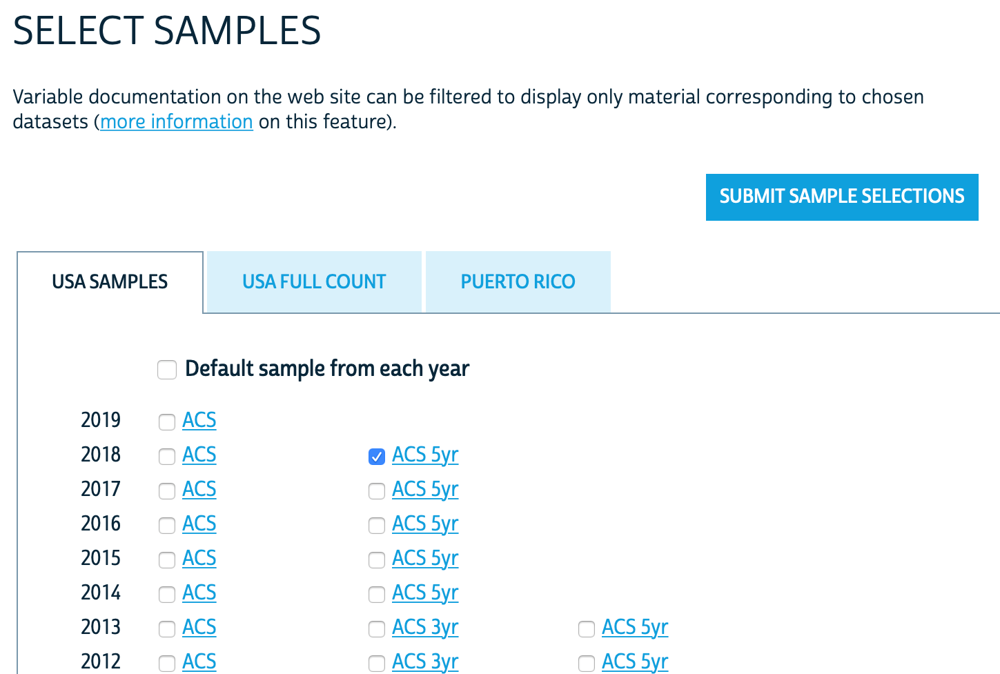

# Downloading and Processing Data

## CCES {#CCES}

The 2018 CCES raw survey data can be downloaded from the [CCES Dataverse](https://dataverse.harvard.edu)
via [this link](https://dataverse.harvard.edu/api/access/datafile/3588803?format=original&gbrecs=true);
by default the downloaded filename is called `cces18_common_vv.csv`.

Every MRP study requires some degree of data wrangling in order to make the factors in the survey of interest match the factors available in census data and other population-level surveys and census. Here we use the [R Tidyverse](https://www.tidyverse.org/) to process the survey data so that it aligns with the postratification table. Because initial recoding errors are fatal, it is important to check that each step of the recoding process produces expected results, either by viewing or summarizing the data.  Because the data is all tabular data, we use the utility function [`head`](https://www.rdocumentation.org/packages/utils/versions/3.6.2/topics/head) to inspect the first few lines of a dataframe before and after each operation.

First, we examine the contents of the data as downloaded, looking only at those columns which provide the demographic-geographic information of interest. In this case, these are labeled as `inputstate`, `gender`, `birthyr`, `race`, and `educ`.

```{r results="asis", cache=FALSE}
cces_all <- read.csv("cces18_common_vv.csv")
```

```{r echo=FALSE, warning=FALSE, cache=FALSE}
kable(head(select(cces_all, inputstate, gender, birthyr, race, educ)), format='markdown')
```

As we have seen, it is crucial that the geography and demographics for the survery must match the geography and demographics in the poststratification table. If there is not a direct one-to-one relationship between the survey and the population data, the survey data must be recoded until a clean mapping exists. We write R functions to encapsulate the recoding steps.

We start considering the geographic information. Both the CCES survey and the US Census data use numeric [FIPS codes](https://transition.fcc.gov/oet/info/maps/census/fips/fips.txt) to record state information. We can use R factors to map FIPS codes to the standard two-letter state name abbreviations. Because both surveys use this encoding, we make this into a reusable function `recode_fips`.

```{r results="asis", cache=FALSE}
# Note that the FIPS codes include the district of Columbia and US territories which
# are not considered in this study, creating some gaps in the numbering system.
state_ab <- datasets::state.abb
state_fips <- c(1,2,4,5,6,8,9,10,12,13,15,16,17,18,19,20,21,22,23,24,25,26,27,28,29,30,
                31,32,33,34,35,36,37,38,39,40,41,42,44,45,46,47,48,49,50,51,53,54,55,56)
recode_fips <- function(column) {
    factor(column, levels = state_fips, labels = state_ab)
}
```

Secondly, we recode the demographics in order for them to be compatible with the American Community Survey data. In some cases this requires changing the levels of a factor (e.g. ethnicity) and in others we may need ot split a continous variable into different intervals (e.g. age). `clean_cces` uses the `recode_fips` function defined above to clean up the states. By default, the `clean_cces` functions drops rows where there is non-response in any of the considered factors or in the outcome variable; if this information is not missing at random, this introduces (more) bias into our survey.

```{r}
# Recode CCES
clean_cces <- function(df, remove_nas = TRUE){
  
  ## Abortion -- dichotomous (0 - Oppose / 1 - Support)
  df$abortion <- abs(df$CC18_321d-2)
  
  ## State -- factor
  df$state <- recode_fips(df$inputstate)
  
  ## Gender -- dichotomous (coded as -0.5 Female, +0.5 Male)
  df$male <- abs(df$gender-2)-0.5
  
  ## ethnicity -- factor
  df$eth <- factor(df$race,
                   levels = 1:8,
                   labels = c("White", "Black", "Hispanic", "Asian", "Native American", 
                              "Mixed", "Other", "Middle Eastern"))
  df$eth <- fct_collapse(df$eth, "Other" = c("Asian", "Other", "Middle Eastern", 
                                             "Mixed", "Native American"))
  
  ## Age -- cut into factor
  df$age <- 2018 - df$birthyr
  df$age <- cut(as.integer(df$age), breaks = c(0, 29, 39, 49, 59, 69, 120), 
                labels = c("18-29","30-39","40-49","50-59","60-69","70+"),
                ordered_result = TRUE)
  
  ## Education -- factor
  df$educ <- factor(as.integer(df$educ), 
                    levels = 1:6, 
                    labels = c("No HS", "HS", "Some college", "Associates", 
                               "4-Year College", "Post-grad"), ordered = TRUE)
  df$educ <- fct_collapse(df$educ, "Some college" = c("Some college", "Associates"))  
  
  # Filter out unnecessary columns and remove NAs
  df <- df %>% select(abortion, state, eth, male, age, educ) 
  if (remove_nas){
    df <- df %>% drop_na()
  }
  
  return(df)
}
```

## American Community Survey {#ACS}

We used the US American Community Survey to create a poststratification table. We will show two different (but equivalent) ways to do this. 

### Alternative 1: IPUMS {.unnumbered #ACS-IPUMS}

The [Integrated Public Use Microdata Series (IPUMS)](https://ipums.org/what-is-ipums) (@ipums2020) is a service run by the University of Minnesota that allows easy access to census and survey data. We focus on the IPUMS USA section, which preserves and harmonizes US census microdata, including the American Community Survey. Other researchers may be interested in IPUMS international, which contains census microdata for over 100 countries.

In order to create the poststratification table we took the following steps:

1. Register at IPUMS using the following [link](https://uma.pop.umn.edu/usa/user/new)
2. On ipums.org, select [IPUMS USA](https://uma.pop.umn.edu/usa/user/new) and then click on “Get Data”. This tool allows to easily select certain variables from census microdata using an intuitive point-and-click interface.

```{r, echo=FALSE, out.width = '50%', fig.align='center'}
knitr::include_graphics("screenshots/screenshot1.png")
```

3. We first need to select a sample (i.e. the survey we want to use for the poststratification table) with a menu that is opened by clicking on the SELECT SAMPLES button shown above. In our case, we we will select the 2018 5-year ACS survey and then click on SUBMIT SAMPLE.

```{r, echo=FALSE, out.width = '50%', fig.align='center'}

```

4. After selecting the sample we need to select the variables that will be included in our poststratification table. The multiple variables are conveniently categorized by HOUSEHOLD (household-level variables), PERSON (individual-level variables), and A-Z (alphabetically). For instance, clicking on PERSON > DEMOGRAPHIC displays the demographic variables, as shown below. Note that the rightmost column shows if that variable is available in the 2018 5-year ACS. Note that if you click on a certain variable IPUMS will provide a description and show the codes and frequencies. Based on the data available in your survey of interest, this is a useful tool to decide which variables to include in the poststratification table. In our case, we select:

*	On PERSON > DEMOGRAPHIC select SEX and AGE
*	On PERSON > RACE, ETHNICITY, AND NATIVITY select RACE, HISPAN, and CITIZEN
*	On PERSON > EDUCATION select EDUC
*	On HOUSEHOLD > GEOGRAPHIC select STATEFIP

```{r, echo=FALSE, out.width = '50%', fig.align='center'}
knitr::include_graphics("screenshots/screenshot3.png")
```

6. We can review the variables we have selected by clicking on VIEW CART. This view also includes the ones which are automatically selected by IPUMS.

```{r, echo=FALSE, out.width = '45%', fig.align='center'}
knitr::include_graphics("screenshots/screenshot4.png")
```

7. After reviewing these variables we should select CREATE DATA EXTRACT. By default the data format is a .dat with fixed-width text, but if we prefer we can change this to csv. After clicking SUBMIT EXTRACT the data will be generated. This can take a while, but you will receive an email when the file is ready for download.

```{r, echo=FALSE, out.width = '45%', fig.align='center'}
knitr::include_graphics("screenshots/screenshot5.png")
```

7. Lastly, we download and preprocess the data. There are two main considerations:

    + Focus on the population of interest: We must take into account that the population of interest for the CCES survey, which only considers US citizens above 18 years of age, is different from the population reflected in the ACS. Therefore, we had to remove the cases of underages and non-citizens in the census data.

    + Match the levels of the two datasets: The levels of the variables in the poststratification table must match the levels of the variables in the CCES dataset. This required preprocessing the variables of the CCES and ACS in a way that the levels were compatible.

```{r, eval=FALSE}
## Read data downloaded from IPUMS. This step can be slow, as the dataset is almost 1.5Gb
temp_df <- read.csv('usa_00001.csv')

## Remove non-citizens
temp_df <- temp_df %>% filter(CITIZEN<3)

## State
temp_df$state <- temp_df$STATEFIP

## Gender
temp_df$male <- abs(temp_df$SEX-2)-0.5

## Ethnicity
temp_df$RACE <- factor(temp_df$RACE, 
                        levels = 1:9, 
                        labels = c("White", "Black", "Native American", "Chinese",
                                   "Japanese", "Other Asian or Pacific Islander", 
                                   "Other race, nec", "Two major races", 
                                   "Three or more major races"))
temp_df$eth <- fct_collapse(temp_df$RACE, 
                            "Other" = c("Native American", "Chinese", 
                                        "Japanese", "Other Asian or Pacific Islander", 
                                        "Other race, nec", "Two major races", 
                                        "Three or more major races"))
levels(temp_df$eth) <- c(levels(temp_df$eth), "Hispanic")
## add hispanic as ethnicity. This is done only for individuals that indicate being white 
# in RACE and of hispanic origin in HISPAN
temp_df$eth[(temp_df$HISPAN!=0) & temp_df$eth=="White"] <- "Hispanic"

## Age
temp_df$age <- cut(as.integer(temp_df$AGE), breaks = c(0, 17, 29, 39, 49, 59, 69, 120),
                   labels = c("0-17", "18-29","30-39","40-49","50-59","60-69","70+"),
                   ordered_result = TRUE)
# filter out underages
temp_df <- filter(temp_df, age!="0-17")
temp_df$age <- droplevels(temp_df$age)

## Education
# we need to use EDUCD (i.e. education detailed) instead of EDUC (i.e. general codes), as the
# latter does not contain enough information about whether high school was completed or not.
temp_df$educ <- cut(as.integer(temp_df$EDUCD), c(0, 61, 64, 100, 101, Inf), 
                    ordered_result = TRUE,
                    labels = c("No HS", "HS", "Some college", "4-Year College", "Post-grad"))

# Clean temp_df by dropping NAs and cleaning states with recode_fips
temp_df <- temp_df %>% drop_na(state, eth, male, age, educ, PERWT) %>% 
  select(state, eth, male, age, educ, PERWT) %>% filter(state %in% state_fips) %>% 
  mutate(state = recode_fips(state))
# Generate cell frequencies using groupby
poststrat_df <- temp_df %>%
  group_by(state, eth, male, age, educ, .drop = FALSE) %>% 
  summarise(n = sum(as.numeric(PERWT)))
# Write as csv
write.csv(poststrat_df, "poststrat_df.csv", row.names = FALSE)
```

If you use IPUMS in your project, don’t forget to [cite it](https://ipums.org/about/citation).

### Alternative 2: ACS PUMS {.unnumbered #ACS-PUMS}

Some researchers may prefer to access the 2018 5-year ACS data directly without using IPUMS, which makes the process less intuitive but also more reproducible. Additionally, this does not require creating an account, as the Public Use Microdata Sample (PUMS) from the ACS can be downloaded directly from the [data repository](https://www2.census.gov/programs-surveys/acs/data/pums/2018/5-Year/). The repository contains two .zip files for each state: one for individual-level variables and other for household-level variables. All the variables considered in our analysis are available in the individual-level files, but we will also download and process the household-level variable income to show how this could be done.

```{r, eval=FALSE}
# We start downloading all the zip files using wget. If you are using Windows you can download
# a pre-built wget from http://gnuwin32.sourceforge.net/packages/wget.htm
dir.create("poststrat_data/")
system('wget -O poststrat_data -e robots=off -nd -A "csv_*.zip" -R "index.html","csv_hus.zip","csv_pus.zip" 
       https://www2.census.gov/programs-surveys/acs/data/pums/2018/5-Year/')
```

If this does not work, you can also access the [data repository](https://www2.census.gov/programs-surveys/acs/data/pums/2018/5-Year/) and download the files directly from your browser.

Once the data is downloaded, we process the .zip files for each state and then merge them together. IPUMS integrates census data accross different surveys, which results in different naming conventions and levels in some of the variables with respect to the PUMS data directly downloaded from the ACS repository. Therefore, the preprocessing steps is slightly different from the code shown above, but as the underlying data is the same we obtain an identical poststratification table.

```{r, eval=FALSE}
list_states_abb <- datasets::state.abb
list_states_num <- rep(NA, length(list_states_abb))

list_of_poststrat_df <- list()

for(i in 1:length(list_states_num)){
  # Unzip and read household and person files for state i
  p_name <- paste0("postrat_data/csv_p", tolower(list_states_abb[i]),".zip")
  h_name <- paste0("postrat_data/csv_h", tolower(list_states_abb[i]),".zip")
  p_csv_name <- grep('\\.csv$', unzip(p_name, list=TRUE)$Name, ignore.case=TRUE, value=TRUE)
  temp_df_p_state <- fread(unzip(p_name, files = p_csv_name), header=TRUE, 
                           select=c("SERIALNO","ST","CIT","PWGTP","RAC1P","HISP","SEX",
                                    "AGEP","SCHL"))
  h_csv_name <- grep('\\.csv$', unzip(h_name, list=TRUE)$Name, ignore.case=TRUE, value=TRUE)
  temp_df_h_state <- fread(unzip(h_name, files = h_csv_name),
                         header=TRUE, select=c("SERIALNO","FINCP"))
  
  # Merge the individual and household level variables according to the serial number
  temp_df <- merge(temp_df_h_state, temp_df_p_state, by = "SERIALNO")

  # Update list of state numbers that will be used later
  list_states_num[i] <-  temp_df$ST[1]

  ## Filter by citizenship
  temp_df <- temp_df %>% filter(CIT!=5)

  ## State
  temp_df$state <- temp_df$ST

  ## Gender
  temp_df$male <- abs(temp_df$SEX-2)-0.5

  ## Tthnicity
  temp_df$RAC1P <- factor(temp_df$RAC1P, 
                          levels = 1:9, 
                          labels = c("White", "Black", "Native Indian", "Native Alaskan",
                                     "Native Indian or Alaskan", "Asian", "Pacific Islander", 
                                     "Other", "Mixed"))
  temp_df$eth <- fct_collapse(temp_df$RAC1P, "Native American" = c("Native Indian", 
                                                                   "Native Alaskan",
                                                                   "Native Indian or Alaskan"))
  temp_df$eth <- fct_collapse(temp_df$eth, "Other" = c("Asian", "Pacific Islander", "Other", 
                                                       "Native American", "Mixed"))
  levels(temp_df$eth) <- c(levels(temp_df$eth), "Hispanic")
  temp_df$eth[(temp_df$HISP!=1) & temp_df$eth=="White"] <- "Hispanic"

  ## Age
  temp_df$age <- cut(as.integer(temp_df$AGEP), breaks = c(0, 17, 29, 39, 49, 59, 69, 120),
                     labels = c("0-17", "18-29","30-39","40-49","50-59","60-69","70+"),
                     ordered_result = TRUE)
  # filter out underages
  temp_df <- filter(temp_df, age!="0-17")
  temp_df$age <- droplevels(temp_df$age)

  ## Income (not currently used)
  temp_df$income <- cut(as.integer(temp_df$FINCP), 
                        breaks = c(-Inf, 9999, 19999, 29999, 39999, 49999, 59999, 69999, 79999, 
                                   99999, 119999, 149999, 199999, 249999, 349999, 499999, Inf),
                        ordered_result = TRUE, 
                        labels = c("<$10,000", "$10,000 - $19,999", "$20,000 - $29,999", 
                                   "$30,000 - $39,999", "$40,000 - $49,999",
                                   "$50,000 - $59,999", "$60,000 - $69,999",
                                   "$70,000 - $79,999","$80,000 - $99,999",
                                   "$100,000 - $119,999", "$120,000 - $149,999",
                                   "$150,000 - $199,999","$200,000 - $249,999",
                                   "$250,000 - $349,999", "$350,000 - $499,999",
                                   ">$500,000"))
  temp_df$income <- fct_explicit_na(temp_df$income, "Prefer Not to Say")

  ## Education
  temp_df$educ <- cut(as.integer(temp_df$SCHL), breaks = c(0, 15, 17, 19, 20, 21, 24), 
                      ordered_result = TRUE,
                      labels = c("No HS", "HS", "Some college", "Associates", 
                                 "4-Year College", "Post-grad"))
  temp_df$educ <- fct_collapse(temp_df$educ, "Some college" = c("Some college", "Associates"))
  
  # Calculate the poststratification table
  temp_df <- temp_df %>% drop_na(state, eth, male, age, educ, PWGTP) %>% 
    select(state, eth, male, age, educ, PWGTP)
  
  ## We sum by the inidividual-level weight PWGTP
  list_of_poststrat_df[[i]] <- temp_df %>% 
    group_by(state, eth, male, age, educ, .drop = FALSE) %>% 
    summarise(n = sum(as.numeric(PWGTP)))

  print(paste0("Data from ", list_states_abb[i], " completed"))
}

# Join list of state-level poststratification files
poststrat_df <- rbindlist(list_of_poststrat_df)
# Clean up state names
poststrat_df$state <- recode_fips(state)
# Write as csv
write.csv(poststrat_df, "poststrat_df.csv", row.names = FALSE)
```

